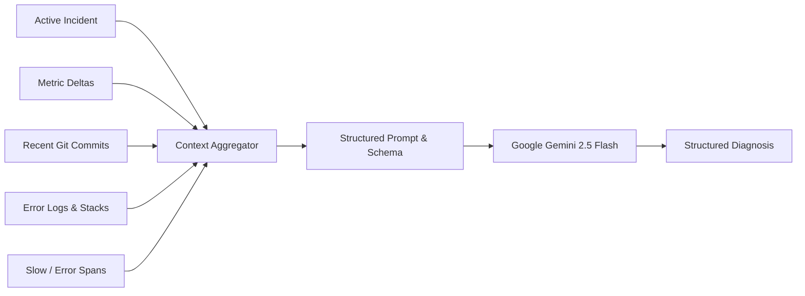

# AI Incident Investigation

RadarFlow includes an optional, pluggable **AI Root Cause Analysis (RCA)** engine powered by Google Gemini. It analyzes incidents by synthesizing anomalous metric deltas, recent code deployments, exception stack traces, and slow trace spans into structured technical findings.

> **Important**: AI analysis is an **optional enhancement**, not a system requirement. RadarFlow's automated incident detection, metrics aggregation, log exploration, and distributed tracing work completely without any AI keys configured.

---

## ⚙️ Configuration

To enable AI incident investigations:

1. Obtain a free API key from [Google AI Studio](https://aistudio.google.com/).
2. Add your key to `.env`:
   ```env
   GEMINI_API_KEY=your_gemini_api_key_here
   ```
3. Restart your RadarFlow container or dev server.

---

## 🔍 How AI Investigation Works

When an incident is triggered (either by automated threshold breach or manually), RadarFlow compiles a **Structured Incident Context** payload:



### 1. Context Aggregation
RadarFlow gathers:
- **Anomaly Signals**: Error rate percentage (e.g. `8.5%`), latency surge (e.g. `650ms`), database connection pool usage.
- **Correlated Releases**: The latest deployment within 60 minutes of the incident (e.g. `Deployment #482`, commit `3f8a19d: "Optimized connection pool recycling"`).
- **Related Logs**: Error and fatal logs containing exception messages and stack traces during the anomaly window.
- **Trace Spans**: Failed or slow spans associated with the affected microservice.

### 2. Structured Output Schema
The AI provider evaluates the assembled evidence against strict JSON schema definitions:

```typescript
export interface IncidentAnalysis {
  provider: "gemini" | "noop";
  model: string;
  likelyCause: string;
  confidence: number;          // 0 - 100%
  evidence: string[];          // Bullet points of factual data
  recommendedActions: string[];// Actionable next steps for on-call engineers
  isAiConfigured: boolean;
  analyzedAt: number;
}
```

---

## 📋 Example Investigation Finding

When clicking **"Analyze Root Cause"** on an active incident (e.g. Incident #1042), the analysis displays:

- **Likely Technical Cause**:  
  *"Database connection pool exhaustion on the `api` service following Deployment #482. Connection timeouts increased by 420% after commit `3f8a19d` modified the connection recycling timeout."*
- **Confidence Score**: `88%`
- **Key Evidence Points**:
  - `http.error.rate` surged from `0.1%` to `8.5%` at `19:23 UTC`.
  - `http.request.duration` p95 increased from `42ms` to `650ms`.
  - 4 consecutive `Database connection pool saturated` exception logs captured.
  - Deployment #482 was completed 4 minutes prior to the first error breach.
- **Recommended Investigation Steps**:
  1. Inspect Postgres connection count via `SELECT count(*) FROM pg_stat_activity`.
  2. Rollback Deployment #482 if pool exhaustion persists.
  3. Increase `max_connections` or audit unreleased database transactions in `checkout.ts`.

---

## 🚫 Behavior When No AI Key is Configured

If `GEMINI_API_KEY` is empty or undefined:
- RadarFlow activates the built-in **`NoopAIProvider`**.
- When navigating to an incident, the dashboard clearly shows:  
  *`AI root-cause analysis is currently disabled. Configure GEMINI_API_KEY in your environment to enable automated synthesis.`*
- All automated rule triggers, deployment correlations, and trace inspections continue to function normally.

---

## 🔒 Privacy & Data Boundaries

- **Minimal Scope**: Only telemetry relevant to the specific incident window (5-minute bounding box, affected service logs, and deployment metadata) is transmitted to the AI provider.
- **No Long-Term Storage by Provider**: Data is passed as a single inference prompt.
- **No Database Dumps**: Application databases, customer tables, or raw environment variables are never transmitted.

---

## 💡 Engineering Guidance

AI incident analysis provides **diagnostic suggestions and correlation assistance**, not deterministic assertions. It helps on-call engineers quickly narrow down search space during high-stress outages. Always verify findings against raw metrics, logs, and traces.
