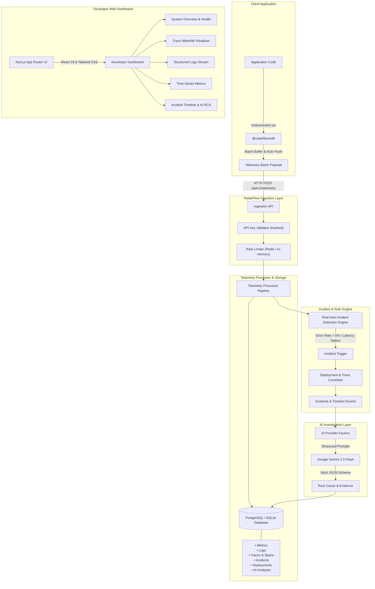

# RadarFlow System Architecture

RadarFlow is a high-performance, modular, and self-hostable observability platform built for modern distributed web applications and microservices.

---

## Architectural Rationale

### 1. Ingestion Pipeline (`/api/v1/telemetry`)
- **Non-Blocking Execution**: Applications instrumented with `@radarflow/sdk` buffer metrics, logs, and spans in memory and dispatch them asynchronously. Network failures are handled gracefully without ever crashing or blocking user requests.
- **Batch Processing**: Telemetry is sent in configurable batches (`batchSize: 50`, `flushIntervalMs: 2000ms`) to minimize HTTP overhead.
- See [SDK Usage Guide](sdk-usage.md) for full client configuration details.

### 2. Telemetry Storage (`lib/db`)
- Relational schema managed with **Drizzle ORM**.
- Dedicated indices on `(project_id, timestamp)`, `(metric_name, timestamp)`, `(trace_id)`, and `(service_id, environment)` ensure sub-millisecond query latencies even with thousands of data points.
- See [Self-Hosting Guide](self-hosting.md) for database configuration and persistence.

### 3. Real-Time Incident Detection Engine (`lib/incident-engine.ts`)
- Evaluates incoming telemetry streams over sliding 5-minute time windows.
- Automatically flags:
  1. **High Error Rate**: When error rate breaches 5% with > 3 failures.
  2. **Latency Degeneration**: When p95/average response latency exceeds configured thresholds (e.g. 500ms).
  3. **Heartbeat Drop**: Flags services when no telemetry is detected within 30 minutes.
- **Automatic Correlation**: Correlates the anomaly with the most recent code deployment (within 60m) and identifies slow spans and timeout logs.

### 4. AI Provider Abstraction (`lib/ai`)
- **Optional & Zero-Hardcoding**: AI capabilities are decoupled behind an `AIProvider` interface. If `GEMINI_API_KEY` is not present, the platform operates at 100% functionality with clear disabled state indicators.
- **Structured Context**: AI prompts contain precise numerical metrics, baseline deltas, deployment commit diffs, exception stack traces, and slow span breakdowns to produce factual, non-hallucinatory diagnoses.
- See [AI Incident Investigation Guide](ai-investigation.md) for prompts, schema, and configuration.

### 5. Developer UI/UX
- High-density dark-first design inspired by modern developer products (Linear, Vercel, Sentry).
- Integrated `⌘K` command palette and global keyboard shortcuts (`G O`, `G I`, `G L`, `G M`, `G T`).
